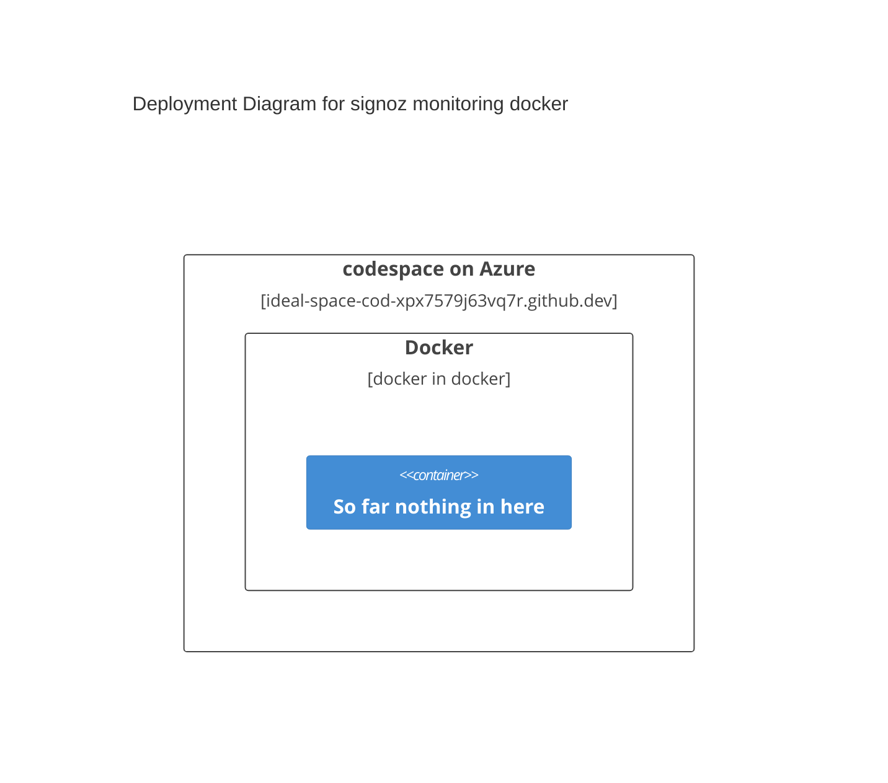

# cdevops-info8985-task1
consume cdevops-signoz as a sub module describe with mermaid and README.md

```mermaid
    C4Deployment
    title Deployment Diagram for signoz monitoring docker

    Deployment_Node(codespace, "codespace on Azure", "ideal-space-cod-xpx7579j63vq7r.github.dev"){

        Deployment_Node(docker, "Docker", "docker in docker"){
            Container(na, "So far nothing in here")
        }
    }
```

